# HeiChips 2026 Tapeout [WIP!]


This repository contains the chip for the [HeiChips Summer School 2026](https://heichips.github.io/) targeting [SG13CMOS5L](https://dk.ihp-microelectronics.com/OpenSourceRequest.php) from IHP. It includes several designs created during the Hackathon all connected to a common eFPGA fabric in the center.
Thanks to FABulous, the user bitstream for the FPGA can be generated using the Yosys and nextpnr toolchain.

The chip is designed with open source EDA tools and the [IHP Open Source PDK](https://github.com/IHP-GmbH/IHP-Open-PDK).

<p align="center">
  <a href="img/heichips26.png">
    
  </a>
</p>

## Feature Overview

The chip includes several user submitted designs from the HeiChips 2026 Hackathon. In the center of the chip is an eFPGA which allows the user projects to connect to each other, utilize the SRAM, or connect to the external I/Os.

- [FABulous](https://github.com/FPGA-Research/FABulous) eFPGA
  - 32x I/Os
  - 288x LUT4 + FF
    - w. carry chain
  - 1x SRAM
    - 4 KiB memory: 32 bit wide, 10 bit deep (1024 entries)
    - individual bit-enable
  - 4x global buffers
  - 1x system reset

The following user projects are included:

<!--- project_table_start -->

| Project       | Size          | Location      | Description  | Link |
|---------------|---------------|---------------|--------------|------|
| Event-Driven Motion SNN | large | X0Y2 | A packetized event-camera filter and time-multiplexed 16-neuron SNN for low-power motion classification. | [Repo](https://github.com/HeiChips/heichips26-aiaccel) |
| E2Spike | large | X0Y7 | This project develops a compact edge AI accelerator for end-to-end spiking neural network inference and on-chip learning, supporting operators such as depthwise convolution, pointwise convolution, and fully connected layers. It also explores SDSP-based lifelong learning and always-on applications such as seizure detection and fall detection. | [Repo](https://github.com/HeiChips/heichips26-e2spike) |
| Intel 1103 Replica | tiny | X5Y1 | This project attempts to recreate the first ever commercially available DRAM memory, the Intel 1103. | [Repo](https://github.com/HeiChips/heichips26_dram_replica) |
| RiMaX | large | X0Y9 | This project uses a simple riscv core and is equipted with an approximate floating point multiplier | [Repo](https://github.com/HeiChips/heichips26-rimax) |
| HeiScore | tiny | X5Y4 | A noRTL written implementation of Pong. | [Repo](https://github.com/HeiChips/heichips26-heiscore) |
| Minimal Multicore Processor | tiny |  | A custom 3-instruction dual-core 8-Bit CPU with a memory management unit supporting atomic swap operations. | [Repo](https://github.com/HeiChips/heichips26-minimal-processor) |
| Noiser | small | X0Y5 | ring-oscillator designs for generating power side-channel noise | [Repo](https://github.com/HeiChips/heichips26_noise_gen) |
| DNA Sequence Aligner | small | X5Y3 | This is a DNA sequence alignment accelerator based on Smith-Waterman algorithm. | [Repo](https://github.com/HeiChips/heichips26-DNA_sequencer) |
| An On-Off keying Transmitter/Receiver | small | X0Y3 | ON OFF keying Transmitter+Receiver. It works by turning a carrier signal ON and OFF to transmit data.I built this because I wanted an RFIC for my first SoC design, and OOK is the simplest.How it works (bit bang mode. from the FPGA side, toggle the transmission pin with your favorite data encoding scheme, and hopefully, you receive something on the other end. I recommend start+stop bits with Manchester encoding, and a symbol duration no shorter than 6us)ui_in[0] is connected to the transmitter tx pin.uo_out[7] to [4] is connected to q3 to q0 of the receiver comparators. | [Repo](https://github.com/HeiChips/heichips26-on-off) |
| Voltage Controlled Resistor | small | X0Y4 | A fully analog component with ohmic behaviour whose resistance value can be changed in accordance with an external analog control voltage. | [Repo](https://github.com/HeiChips/heichips26-voltage-controlled-resistor) |
| daftASIC | small | X5Y8 | An extensively, named daftASIC, designed and expandable music synthesizer built purely in silicon, supporting both visual and audio outputs | [Repo](https://github.com/HeiChips/heichips26-daftasic) |
| Ballmer-Peak-Detector | small | X5Y2 | Edge State Space Model Processing Element using Posit Arithmetic | [Repo](https://github.com/HeiChips/heichips26-ballmer-peak-detector) |

<!--- project_table_end -->

For a full description of the projects, see [User Projects](#user-projects).

## User Projects

<!--- project_list_start -->

### Event-Driven Motion SNN

A packetized event-camera filter and time-multiplexed 16-neuron SNN for low-power motion classification.

<p align="center">
  <a href="img/user_projects/heichips26_event_snn.png">
    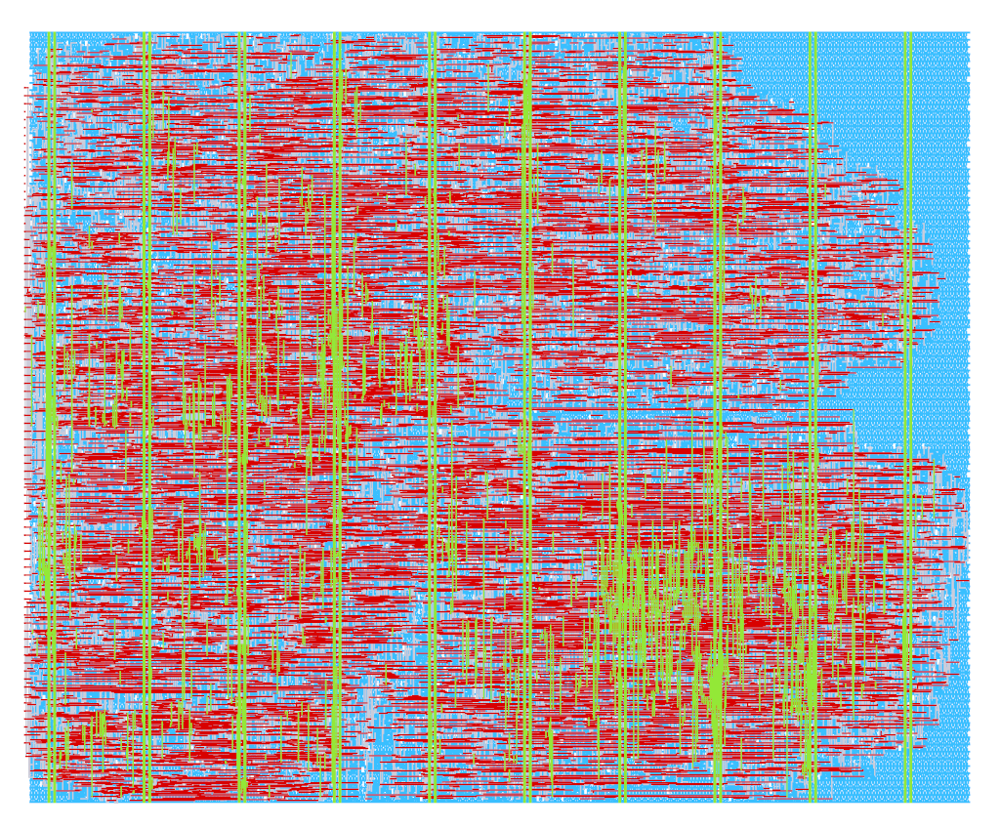
  </a>
</p>

Top cell: `heichips26_event_snn`
Slot size: large
Analog pins: 0
Uses VAPRW: False

Team members:

- Gabriela Mystkowska
- Edvinas Patiejunas
- Jerry Yun
- Marco Vogel

Long description:

Event-Driven Motion SNN accepts 32x32 event-camera coordinates, polarity,
and timestamps through a pin-compliant 16-bit packet interface. A 32-entry
direct-indexed spatiotemporal filter rejects cold, stale, and refractory
events. Accepted events are encoded into eight motion directions and sent to
sixteen programmable leaky-integrate-and-fire neurons. Four neurons vote for
each of four motion classes: east, west, south, and north.

Area is reduced by sharing one signed neuron-update datapath across all
sixteen neurons, using signed 4-bit weights, storing only 12 timestamp bits,
serially initializing the 128 weights, and avoiding redundant result
snapshots. The 16-bit command/response protocol supports event input,
parameter and weight programming, per-event spike reporting, frame-level
classification, counters, backpressure, busy status, and interrupt signaling.

The macro uses the official 500 um x 415 um large-slot DEF, the standard
HeiChips large digital interface, no analog pins, and the ihp-sg13cmos5l
process. It can be tested with the included deterministic unit, wrapper, and
backpressure-aware protocol tests.


### E2Spike

This project develops a compact edge AI accelerator for end-to-end spiking neural network inference and on-chip learning, supporting operators such as depthwise convolution, pointwise convolution, and fully connected layers. It also explores SDSP-based lifelong learning and always-on applications such as seizure detection and fall detection.


<p align="center">
  <a href="img/user_projects/heichips26_e2spike.png">
    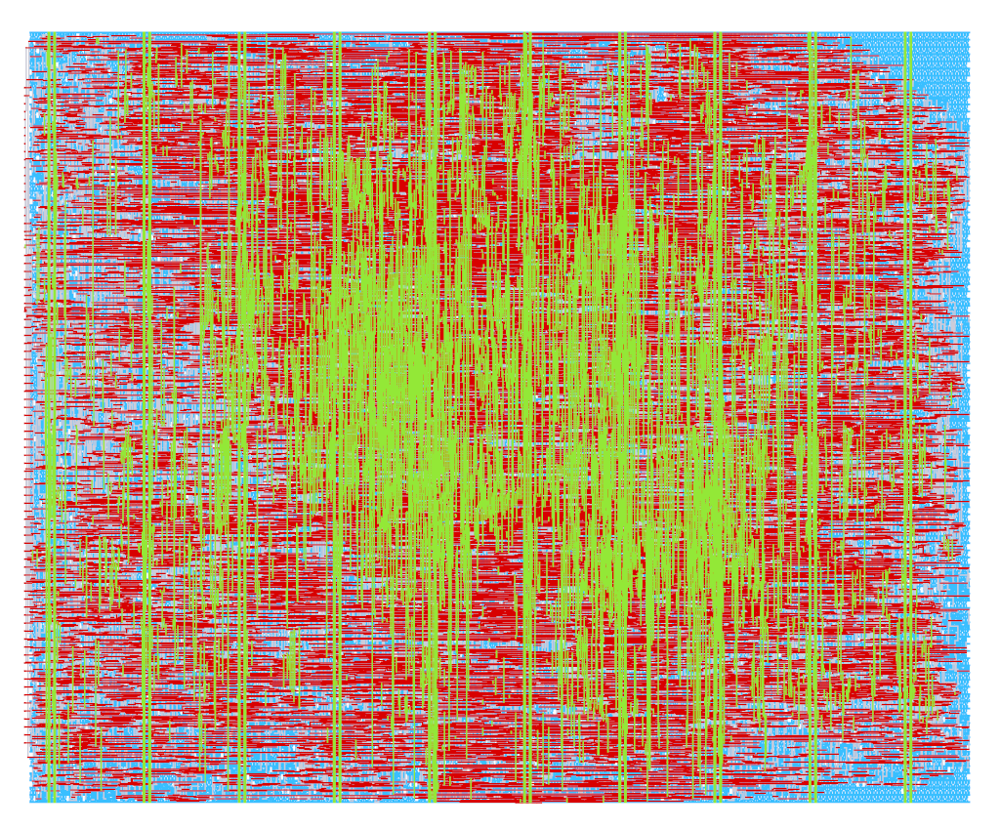
  </a>
</p>

Top cell: `heichips26_e2spike`
Slot size: large
Analog pins: 0
Uses VAPRW: False

Team members:

- Yuehai Chen
- Frank de Weers
- Shuzhong Wang
- Yike Jing
- Sebastian Kallfelz

Long description:

E2Spike was awarded the HeiChips Best Project (Digital) this year. It is a compact
neuromorphic accelerator supporting end-to-end Spiking Neural Network (SNN) inference
and SDSP-based on-chip learning. The current implementation can execute a 12-layer
lightweight SNN for edge applications.

Key features include:

* End-to-end execution of SNN models;
* Support for five operators: depthwise convolution, pointwise convolution,
  max pooling, average pooling, and fully connected operations;
* Validation on EEG-based seizure detection and DVS-based fall detection.

The project is open source and available on
[GitHub](https://github.com/xiaoyuehai/heichips26-e2spike).


### Intel 1103 Replica

This project attempts to recreate the first ever commercially available DRAM memory, the Intel 1103.

<p align="center">
  <a href="img/user_projects/heichips26_dram_replica.png">
    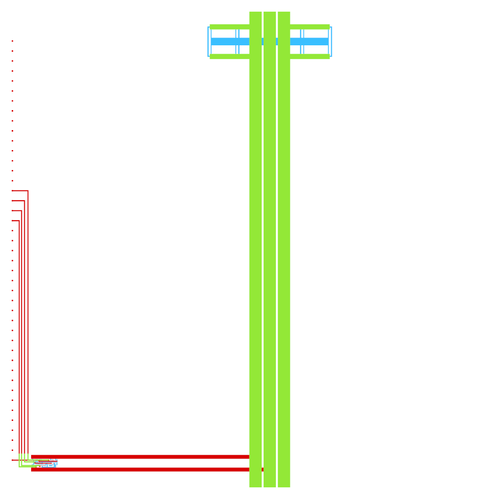
  </a>
</p>

Top cell: `heichips26_dram_replica`
Slot size: tiny
Analog pins: 0
Uses VAPRW: False

Team members:

- Lukas Jahn
- Jonathan Hager
- Barnabás Hidvégi
- Abdelaziz Ider
- Jennifer Muck

Long description:

Featuring an 1024 bit storage array, the Intel 1103 DRAM, introduced in 1970, becaume the first widely used, commercially available semiconductor memory device.
This project attempts to recreate one of the fundamental building blocks of that memory device, a single storage cell, capable of holding one bit.
The implementation abuses parasitic capacitance of one nmos-transistor to hold the bit, consequently requiring refreshes.
The precise control timings will be determined after tapeout, though simulation suggest a periodic refresh time of 100us.

The cell can be controlled via five exposed pins:
* ui_in[3]:  PreCh (precharge):     set high before read
* ui_in[2]:  RWL (read word line):  set high to read from the cell
* ui_in[1]:  WWL (write word line): set high to write to the cell
* ui_in[0]:  WBL (write bit line):  set the wanted bit to be stored
* uo_out[0]: RBL (read bit line):   outputs the stored bit


### RiMaX

This project uses a simple riscv core and is equipted with an approximate floating point multiplier

<p align="center">
  <a href="img/user_projects/heichips26_RiMaX.png">
    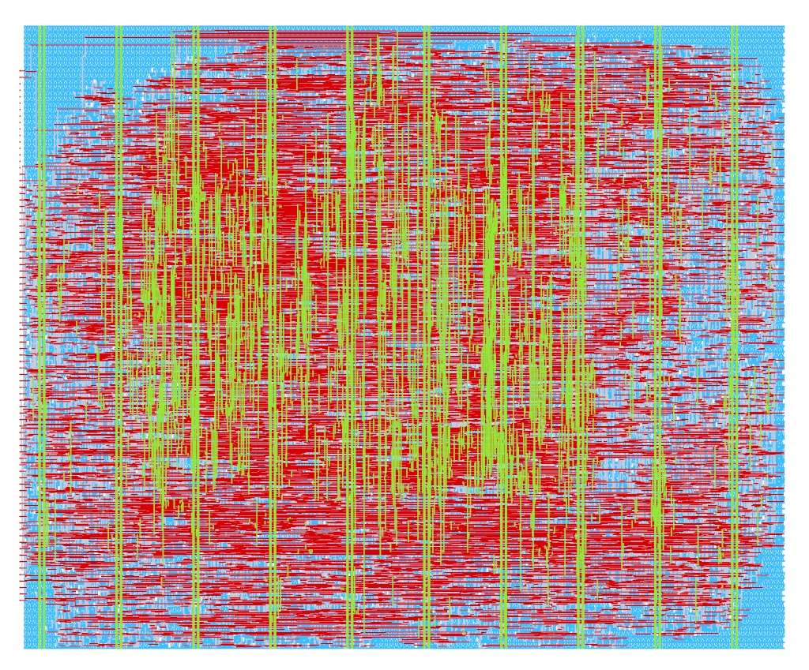
  </a>
</p>

Top cell: `heichips26_RiMaX`
Slot size: large
Analog pins: 0
Uses VAPRW: False

Team members:

- Pouria Hasani
- Nima Amirafshar
- Soheil Khoyooz
- Susindhar Manivasagann

Long description:

This project is about the suitablility of approximation in the arithmatic units for different applications.
The CPU core is picorv32 supporting rv32i ISA. As a co-processor there is an approximate floating point multiplier
which has its own costum instructions. The approximate multiplier is 20 times smaller than the exact counter part
which makes it highly suitable to reduce the area and therefore the cost of the chip. The Error of the multipler has 
MRED of less 10^-3. 
The top module will use the FPGA to forward the mermory access to the off chip and retrive the data. 
The module for the fpga and the connecting module the whole chip have been designed and tested. 


### HeiScore

A noRTL written implementation of Pong.

<p align="center">
  <a href="img/user_projects/heichips26_heiscore.png">
    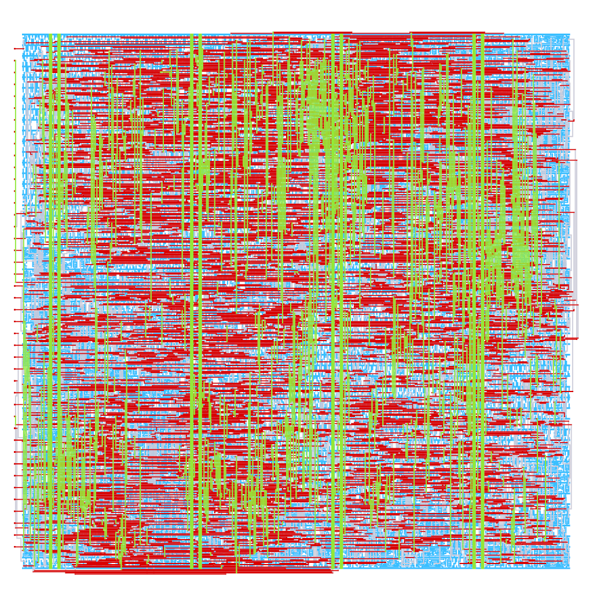
  </a>
</p>

Top cell: `heichips26_heiscore`
Slot size: tiny
Analog pins: 0
Uses VAPRW: False

Team members:

- Georg Gläser
- Nils Stanislawski

Long description:

HeiScore is a complete two-player Pong machine in the 200 x 200 um tiny slot:
no CPU, no framebuffer, no external memory. Running from a 25 MHz clock, it
generates a 640 x 480 @ 60 Hz VGA signal pixel by pixel. The screen shows a
bouncing ball with a colour bitmap, two paddles, a playfield frame and two
7-segment scores. The first player to reach 10 points wins, and the match
restarts.

The design contains no hand-written RTL. It is described in Python with nortl
and emitted as SystemVerilog; only the top-level pin wrapper is written by
hand. The scene is a combinational function of the pixel position, and the
same function drives collision detection. The game state needs only about
110 flip-flops.

Paddles are controlled via ui_in[3:0] (P1/P2 up/down). The VGA output is
1 bit per colour on uo_out in TinyVGA Pmod pin order, and the uio pins are
unused. The design has also been demonstrated on an FPGA (Olimex GateMate)
with a key matrix and an ILI9341 LCD.


### Minimal Multicore Processor

A custom 3-instruction dual-core 8-Bit CPU with a memory management unit supporting atomic swap operations.

<p align="center">
  <a href="img/user_projects/heichips26_minimal_multicore_processor.png">
    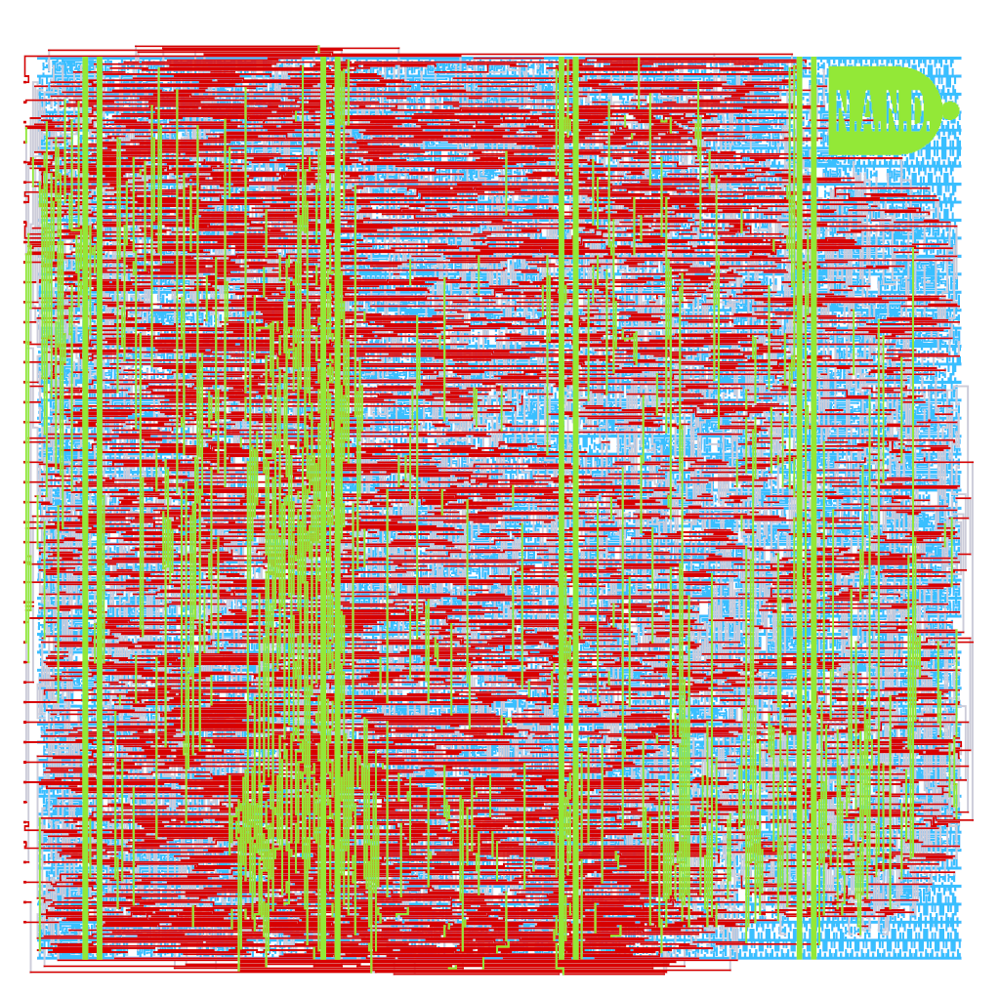
  </a>
</p>

Top cell: `heichips26_minimal_multicore_processor`
Slot size: tiny
Analog pins: 0
Uses VAPRW: False

Team members:

- Jakob Rinke
- Benjamin Steeg
- Daniel Bayer
- Ekrem Altuntop
- Simon Mönch

Long description:

Two custom CPU cores and a custom memory management unit (MMU) in just 200µm x 200µm with a maximum clock frequency of 303MHz. 
Almost entirely engineered in just two days at the HeiChips 2026 Summer School.

##### Top Level Architecture
The two cores use the MMU for all memory interactions, including fetching of instructions. 
The MMU ensures that instructions and data are transferred to the correct core and implements a custom communication protocol 
with the eFPGA. The eFPGA allows the CPUs to interface with the on-chip SRAM or (in the future) with other projects.

##### ISA
| Instruction     | Description                                          |
|-----------------|------------------------------------------------------|
| JMPZ R #imm     | Jump to PC + #imm if, and only if, R = 0             |
| ADDI Ra Rb #imm | Rb = Ra + #imm                                       |
| SWAP Ra Rb      | Swap Ra with value at address saved in Rb (atomic)   |

##### CPU Architecture
The Memory Communicator module interfaces with the MMU and thus is partly responsible for memory access.

##### MMU
The MMU takes load and swap requests from the CPUs and performs the necessary communication with the eFPGA through a custom 
communication protocol. Additionally, the MMU arbits memory access in case of parallel request from the CPUs.

The interface of the MMU is as follows:
| Port           | Description                                                | Dimension (C = #CPUs)  |
|----------------|------------------------------------------------------------|------------------------|
| clk_i          | clock                                                      | 1                      |
| rst_ni         | reset (active low)                                         | 1                      |
| reg_data       | data input from CPUs                                       | Cx8                    |
| ram_addr       | address input from CPUs                                    | Cx8                    |
| valid          | signals from CPUs to request memory operation              | C                      |
| do_swap        | set if and only if CPUs want to perform a swap             | C                      |
| mem_done       | signals to the CPUs that the memory operation was completed| C                      |
| data_out_cpu   | data output to CPUs                                        | 16                     |
| fpga_in1       | lower significance bits input from eFPGA                   | 8                      |
| fpga_in2       | higher significance bits input from eFPGA                  | 8                      |
| fpga_out       | output to eFPGA                                            | 8                      |

Communication between a CPU and the MMU takes place as follows:
1. Setting valid requests a memory transfer. ram_addr, and ram_data if a swap operation is requested, must be set to the 
desired values when valid is set. If a swap is requested, do_swap must also be set when valid is set. valid must be kept 
set until the transfer finishes. ram_addr, ram_data and do_swap must not be changed until the transfer finishes.
2. mem_done signals to the CPU that the transfer has finished and that the data at data_out_cpu is valid. This state is only
kept for one cycle.
3. The CPU acknowledges the finished transfer to the MMU by resetting valid.

Communication between the MMU and the eFPGA takes place as follows:
1. The MMU sends 8'b0000_00x1 over fpga_out to the eFPGA. x is set when a swap is requested and reset when a load is requested.
2. The MMU send the desired address over fpga_out.
3. The MMU waits for the finish of the read operation by waiting until the two LSBs of fpga_in are not 2'b11 (Note that this 
implies that the eFPGA must always set the two LSBs of fpga_in1 to 2'b11.). Because these two bits are at the position of the 
opcode, and 2'b11 is not a valid opcode, they can be used to signal a valid instruction. If a swap is performed, only fpga_in2 
is used for the data.
4. If no swap was requested, go to 6. If a swap was requested, the MMU sends the to be written data over fpga_out. Note that 
since a swap operation is performed, the address from the read operation is also valid for the write operation.
5. The eFPGA signals the finish of the write operation by setting fpga_in1 different from 2'b11.
6. The MMU waits for the receiving CPU to acknowledge before starting the next interaction.


### Noiser

ring-oscillator designs for generating power side-channel noise

<p align="center">
  <a href="img/user_projects/heichips26_noise_gen.png">
    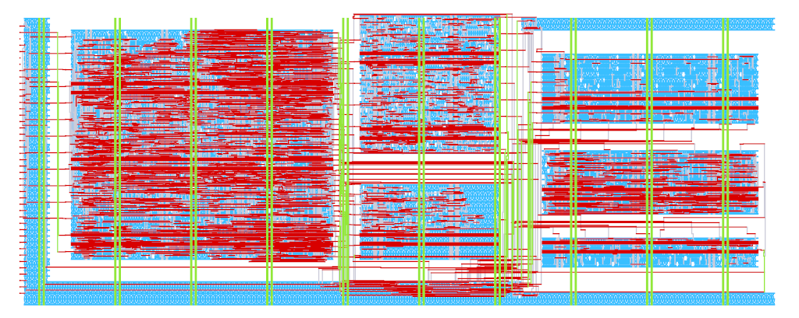
  </a>
</p>

Top cell: `heichips26_noise_gen`
Slot size: small
Analog pins: 0
Uses VAPRW: False

Team members:

- Dina Hesse
- Meinhard Kissich
- Mehmet Uluisik

Long description:

Our design realizes different noisers that are built for generating power side-channel noise to hide secret signals of computations on the eFPGA. The engine includes several ring-oscillator-designs and different loads that can be driven by these ring-oscillators. After tape-out we want to measure the power consumption of the chip (would be nice if there would be ports directly on the PCB for this) and evaluate the effectiveness of different configurations.


### DNA Sequence Aligner

This is a DNA sequence alignment accelerator based on Smith-Waterman algorithm.

<p align="center">
  <a href="img/user_projects/heichips26_dna_sequencer.png">
    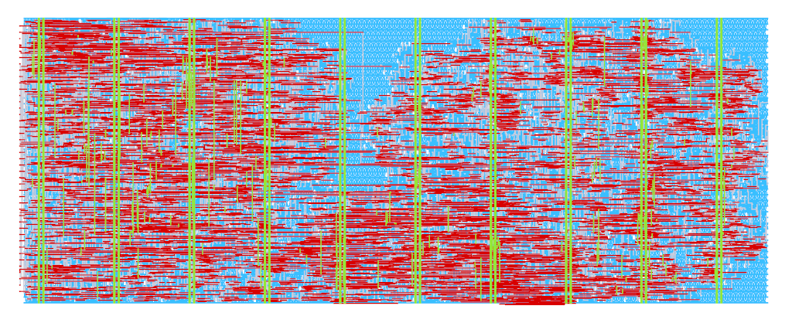
  </a>
</p>

Top cell: `heichips26_dna_sequencer`
Slot size: small
Analog pins: 0
Uses VAPRW: False

Team members:

- Tharindu Samarakoon
- Shangeeth Gopinathan Rajeshkumar
- Udaya Subedi
- Udara Mendis

Long description:


#### DNA Sequence Alignment Accelerator

This project implements a hardware-accelerated DNA sequence alignment
engine based on the Smith-Waterman dynamic programming algorithm.

##### Architecture

- **DNA alignment accelerator**
  - Implemented as a systolic array based ASIC targeting the IHP SG13CMOS5L process
  - Performs the Smith-Waterman algorithm purely in hardware
  - Synthesized with a target operating frequency of 100MHz. 
  - Computes the dynamic programming matrix in parallel using a systolic array
  - Supports 8-character long DNA sequences.
  - Fully pipelined and capable of receiving a new test sequence while previous sequence is still being processed.

- **RISC-V (task specialized) processor**
  - Implemented in eFPGA
  - This is capable of running at 15MHz on the eFPGA.
  - Drives the accelerator
  - Feeds sequences from on-chip memory to the accelerator
  - Stores the alignment results back into memory

##### How It Works

1. The RISC-V processor (in eFPGA) loads the encoded DNA sequences from memory.
2. A specified number of sequences are written to the accelerator's FIFO through its MMIO interface.
3. The systolic array inside the accelerator performs the alignment computation.
4. The processor polls the accelerator status until the results are ready.
5. The alignment score is saved and read from the accelerator's FIFOs.
6. The result is stored back into on-chip memory.

##### Testing

* **SystemVerilog testbench**: macros/heichips26_dna_sequencer/testbenches/verilog/heichips26_dna_sequencer_tb.sv
* **Cocotb testbench**: macros/heichips26_dna_sequencer/testbenches/cocotb/heichips26_dna_sequencer_tb.py

##### Hardware Requirements

- We would like to have
  - A UART interface in the eFPGA which can connect with an external device such as a laptop or RPi (to bypass the RISC-V processor inside the eFPGA if required).
  - A push button to reset.
  - Capability to access the on-chip SRAM from an external device.


### An On-Off keying Transmitter/Receiver

ON OFF keying Transmitter+Receiver. It works by turning a carrier signal ON and OFF to transmit data.

I built this because I wanted an RFIC for my first SoC design, and OOK is the simplest.

How it works (bit bang mode. from the FPGA side, toggle the transmission pin with your favorite data encoding scheme
, and hopefully, you receive something on the other end. I recommend start+stop bits with Manchester encoding, and a symbol duration no shorter than 6us)

ui_in[0] is connected to the transmitter tx pin.
uo_out[7] to [4] is connected to q3 to q0 of the receiver comparators.


<p align="center">
  <a href="img/user_projects/heichips26_ook_top.png">
    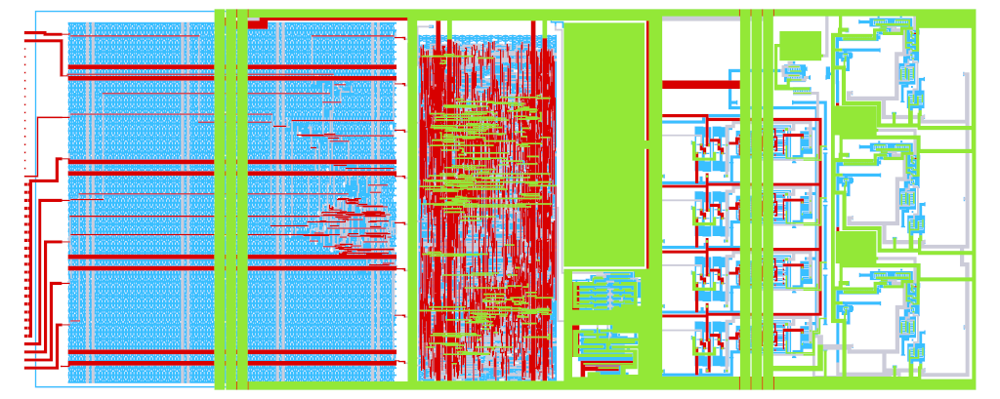
  </a>
</p>

Top cell: `heichips26_ook_top`
Slot size: small
Analog pins: 3
Uses VAPRW: False

Team members:

- Belal Elshinnawey
- Koh Tomita
- Kokoro Kodama
- Francisco Sayas

Long description:

- Receiver design:
  - A 3 stage input amplifier
  - the amplifier connects to a PMOS, connected as a diode
  - the diode uses an off chip capacitor and resistor to form a peak detector
  - the peak detector feeds 4 comparators, each comparator has a threshold that ramps above 900mV based on signal strength
- Transmitter design:
  - The design uses a VCO to lock on 433.92 MHz
  - The VCO feeds an output buffer, which has a transmission gate to turn the output on/off (the OOK part)
  - The buffer also contains a middle tap before the transmission gate to feed the VCO output back
  - The feedback clock is divided using a line of 13 flip-flops. The divided signal is fed to an FSM
  - The FSM computes the frequency error and increases/decreases the duty of a DAC based on the error
  - The DAC connects to a low pass filter which feeds the VCO to set the frequency
- Digital side:
  - The digital side contains a simple 2xFF stage per comparator output to sync the comparators with local clock domain
  - The transmitter is controlled by data_in_tx. This signal drives the transmission gate of the output buffer with dead time insertion
- PCB design:
  - analog-1 pin connects to the off chip accumulator: /plots/accumulator_network.png
  - analog-0 pin is for the sender, it uses the network: /plots/output_network.png
  - analog-2 pin is for the receiver, it uses the network: /plots/input_network.png
  - capacitors under 0.5pF are ignored. use footprints 402, with dielectric NP0/C0G, X7R is ok but not lower. for 0.5pF caps, use RF caps.
  - If the capacitors are too expensive, use place holder 0 ohm resistors for series elements, and open circuits for shunts.
  - The trace should be 50 ohms. If you're using a 2-layer PCB, decrease the thickness to get a reasonable impedance with reasonable trace thickness.
  (I had some good designs with 2-layer PCBs at 1mm thickness)
  - both transmit and receive matching networks should end with your favorite 50 ohm SMA/BNC connector you find at your vendor of choice
  - If my PCB requires too much, and you think it should be my responsibility, email: belalshinnawey@gmail.com and I will provide
  whatever you need regarding this issue. :)


### Voltage Controlled Resistor

A fully analog component with ohmic behaviour whose resistance value can be changed in accordance with an external analog control voltage.

<p align="center">
  <a href="img/user_projects/heichips26_vcr.png">
    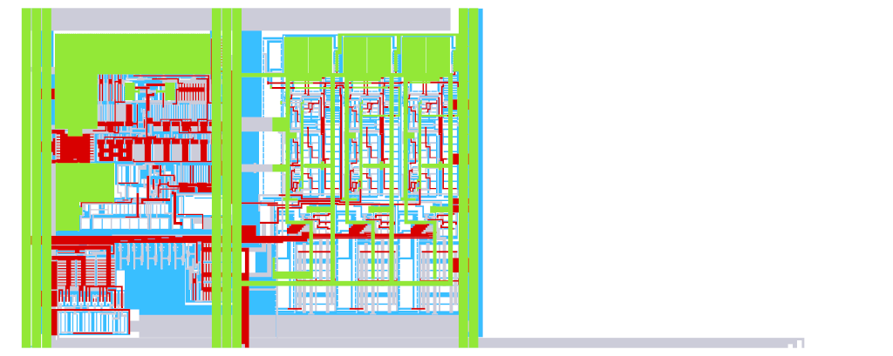
  </a>
</p>

Top cell: `heichips26_vcr`
Slot size: small
Analog pins: 3
Uses VAPRW: False

Team members:

- Clyde
- Santiago
- Mattes
- Sebastian
- Noah

Long description:

We implement three different approaches to accomplish this task.
* bisectional opamp
* floating gate
* switched capacitor
Each implementation will be selectable via integrated analog switches. If we can get some physical switches on the PCB that are connected to the digital pins of the chip, this would be really cool. This way, we could select each of the three implementations without reprogramming the eFPGA.


### daftASIC

An extensively, named daftASIC, designed and expandable music synthesizer built purely in silicon, supporting both visual and audio outputs

<p align="center">
  <a href="img/user_projects/heichips26_daftASIC.png">
    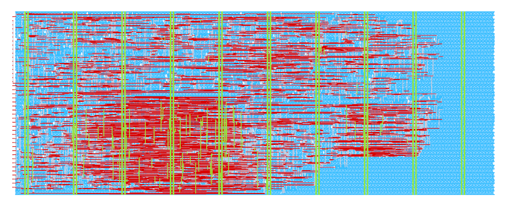
  </a>
</p>

Top cell: `heichips26_daftASIC`
Slot size: small
Analog pins: 0
Uses VAPRW: False

Team members:

- Alexander-Odysseus Farmakis
- Karolina Piotrowska
- Alisa Stiballe
- Riccardo Tedeschi

Long description:

A music synthesizer built purely in silicon, daftASIC supports both visual and audio outputs. The music synthesizer designed supports
PS/2 keyboard inputs, VGA output for the score and a PWM driver for the audio output. It supports multiple note durations (full, half,
quarter and eighth notes), as well as various effects (phaser, staccato). daftASIC can be extended to include an automatic melody input
system for automatic reproduction of programmed melodies.

Features include:
  - PWM-based waveform generator for audio production and effects
  - VGA-based score viewer with dynamic placement of incoming notes and the current active effect
  - PS/2-based keyboard input for user interaction with the system
  - Character ROMs for the visuals of the score

No external analog circuitry is required beyond the standard board connections, however some filtering and amplification
of the PWM signal could make the sounds produced more pleasant for some.


### Ballmer-Peak-Detector

Edge State Space Model Processing Element using Posit Arithmetic

<p align="center">
  <a href="img/user_projects/heichips26_ballmer_peak_detector.png">
    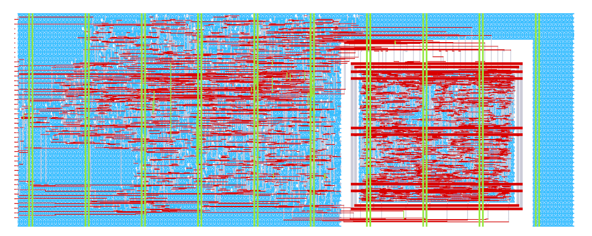
  </a>
</p>

Top cell: `heichips26_ballmer_peak_detector`
Slot size: small
Analog pins: 0
Uses VAPRW: False

Team members:

- Fabian Seiler
- Felix Blenk
- Luke Vassallo
- Simon Veser
- Tassilo Tanneberger

Long description:

A processing element that targets edge-specific SSM layers (S-Edge). 
- The operations are based on complex MAC operations and a scheduling unit implemented with Posit Arithmetic.

and [links](https://github.com/tanneberger/ballmer-peak-detector).


<!--- project_list_end -->

## Configuration of the FPGA Fabric

The eFPGA fabric can be configured using the SPI peripheral or the SPI controller, depending on the value of `fpga_mode`.

| fpga_mode | description |
|---|---|
| 0 | Active SPI mode. |
| 1 | Passive SPI mode. |

If active SPI mode is selected and fpga_rst_n is deasserted, the configuration logic will fetch the bitstream from slot 0 (address 0) of the external SPI flash. Using fpga_config_slot[3:0] and fpga_config_trigger (which is only possible when the configuration logic is not busy), it is possible to initiate reconfiguration from a different slot.
The offset of the slots is 0x800 words (0x2000 bytes). The controller uses the first 0x5A6 words (0x1698 bytes) of a slot as the bitstream.

If passive SPI mode is selected, the bitstream can be supplied via an external SPI controller.

## Specification

The IO voltage (IOVDD) should be 3.3V.
The core voltage (VDD) should be 1.2V.

The top level, including the configuration logic, was implemented for the following corners at 80MHz and is free of setup and hold violations.

- nom_typ_1p20V_25C
- nom_fast_1p32V_m40C
- nom_slow_1p08V_125C
- nom_typ_1p50V_25C
- nom_fast_1p65V_m40C
- nom_slow_1p35V_125C

Using a core voltage higher than 1.65V (while remaining within the safe operating area) may still work, but could lead to hold violations in the configuration logic. If that happens, you can try increasing the voltage after configuration of the FPGA is complete.

## Pinout

<p align="center">
  <a href="img/heichips26_bonding.png">
    
  </a>
</p>

| Pin name                | Description                   |
|-------------------------|-------------------------------|
| fpga_clk                | The clock for the FPGA configuration logic. |
| fpga_rst_n              | The reset for the FPGA configuration logic (active low) |
| fpga_mode               | Set configuration mode. 0 = active, 1 = passive. |
| fpga_config_busy        | High while the FPGA is under configuration. |
| fpga_config_configured  | High after the FPGA has been configured. |
| fpga_sclk               | SPI: source clock             |
| fpga_cs_n               | SPI: chip select (active low) |
| fpga_mosi               | SPI controller out, peripheral in |
| fpga_miso               | SPI: controller in, peripheral out |
| fpga_config_trigger     | If high, trigger a reconfiguration in active mode from one of 16 slots of the SPI flash. |
| fpga_config_slot[0]     | Set bit 0 for the FPGA configuration slot. |
| fpga_config_slot[1]     | Set bit 1 for the FPGA configuration slot. |
| fpga_config_slot[2]     | Set bit 2 for the FPGA configuration slot. |
| fpga_config_slot[3]     | Set bit 3 for the FPGA configuration slot. |
| ...                     | Pin of the ... project. |
| ...                     | Pin of the ... project. |
| ...                     | Pin of the ... project. |
| ...                     | Pin of the ... project. |
| ...                     | Pin of the ... project. |
| ...                     | Pin of the ... project. |
| ...                     | Pin of the ... project. |
| ...                     | Pin of the ... project. |
| ...                     | Pin of the ... project. |
| ...                     | Pin of the ... project. |
| ...                     | Pin of the ... project. |
| ...                     | Pin of the ... project. |
| ...                     | Pin of the ... project. |
| ...                     | Pin of the ... project. |
| ...                     | Pin of the ... project. |
| ...                     | Pin of the ... project. |
| ...                     | Pin of the ... project. |
| ...                     | Pin of the ... project. |
| fpga_io[0]              | I/O pin which can be controlled by the FPGA user project. |
| fpga_io[1]              | I/O pin which can be controlled by the FPGA user project. |
| fpga_io[2]              | I/O pin which can be controlled by the FPGA user project. |
| fpga_io[3]              | I/O pin which can be controlled by the FPGA user project. |
| fpga_io[4]              | I/O pin which can be controlled by the FPGA user project. |
| fpga_io[5]              | I/O pin which can be controlled by the FPGA user project. |
| fpga_io[6]              | I/O pin which can be controlled by the FPGA user project. |
| fpga_io[7]              | I/O pin which can be controlled by the FPGA user project. |
| fpga_io[8]              | I/O pin which can be controlled by the FPGA user project. |
| fpga_io[9]              | I/O pin which can be controlled by the FPGA user project. |
| fpga_io[10]             | I/O pin which can be controlled by the FPGA user project. |
| fpga_io[11]             | I/O pin which can be controlled by the FPGA user project. |
| fpga_io[12]             | I/O pin which can be controlled by the FPGA user project. |
| fpga_io[13]             | I/O pin which can be controlled by the FPGA user project. |
| fpga_io[14]             | I/O pin which can be controlled by the FPGA user project. |
| fpga_io[15]             | I/O pin which can be controlled by the FPGA user project. |
| fpga_io[16]             | I/O pin which can be controlled by the FPGA user project. |
| fpga_io[17]             | I/O pin which can be controlled by the FPGA user project. |
| fpga_io[18]             | I/O pin which can be controlled by the FPGA user project. |
| fpga_io[19]             | I/O pin which can be controlled by the FPGA user project. |
| fpga_io[20]             | I/O pin which can be controlled by the FPGA user project. |
| fpga_io[21]             | I/O pin which can be controlled by the FPGA user project. |
| fpga_io[22]             | I/O pin which can be controlled by the FPGA user project. |
| fpga_io[23]             | I/O pin which can be controlled by the FPGA user project. |
| fpga_io[24]             | I/O pin which can be controlled by the FPGA user project. |
| fpga_io[25]             | I/O pin which can be controlled by the FPGA user project. |
| fpga_io[26]             | I/O pin which can be controlled by the FPGA user project. |
| fpga_io[27]             | I/O pin which can be controlled by the FPGA user project. |
| fpga_io[28]             | I/O pin which can be controlled by the FPGA user project. |
| fpga_io[29]             | I/O pin which can be controlled by the FPGA user project. |
| fpga_io[30]             | I/O pin which can be controlled by the FPGA user project. |
| fpga_io[31]             | I/O pin which can be controlled by the FPGA user project. |


## Building User Designs for the eFPGA

To build a bitstream of a user design for the eFPGA, see [README.md](ip/fabric/user_designs/README.md) under `ip/fabric/user_design`.

## Building the Chip

### Prerequisites

> [!NOTE]
> Either clone the repo using the following command: 
>```console
>git clone --recurse-submodules git@github.com:FPGA-Research/heichips25-tapeout.git
>```
> or initialize the submodules if you cloned the repo without them:
>
>```console
> git submodule update --init --recursive .
>```

To clone the compatible PDK version, simply run `make clone-pdk`.

For information on installing Nix with the FOSSi Foundation cache, please refer to the LibreLane documentation: https://librelane.readthedocs.io/en/stable/installation/nix_installation/index.html

Afterwards you can enable a Nix shell by running `nix-shell`.

## Stitch the Fabric

As a prerequisite make sure that the tiles for the tile library that you are using have been implemented in `ip/fabulous-tiles`.
If that is the case, you can proceed by enabling a Nix shell with LibreLane in this repository:

```
nix-shell
```

To implement the fabric, run:

```
make classic_fabric_heichips26
```

After the fabric has been implemented you can view it either in OpenROAD or KLayout by appending `-openroad` or `-klayout` to the fabric name.
For example, to view `classic_fabric_heichips26` in OpenROAD, run: `make classic_fabric_heichips26-openroad`.

After the fabric has been generated, run:

```
make classic_fabric_heichips26-copy
```

This copies the fabric database to `user_designs/`.

### Build The Chip

To build the chip with LibreLane:

```console
make librelane
```

To view the design in OpenROAD:

```console
make librelane-openroad
```

Or to view it in KLayout:

```console
make librelane-klayout
```

And with this the chip is ready for tapeout. 

## Implement User Designs

Please see the README in `user_designs/` on how to implement a user design for the fabrics.

### Simulate the Fabric

To run all fabric simulations, simply run one of:

```
make sim-fabric             # RTL sim of the fabric
make sim-fabric-emulation   # RTL sim of the fabric, bitstream preloaded
make sim-fabric-gl          # GL sim of the fabric (after implementation)
```

To view the waveform results:

```
make sim-fabric-view
```

### Simulate the Chip

To run all chip top simulations, simply run one of:

```
make sim-top             # RTL sim of chip top
make sim-top-emulation   # RTL sim of chip top, bitstream preloaded
make sim-top-gl          # GL sim of chip top (after implementation)
```

To view the waveform results:

```
make sim-top-view
```

## License

The chip is licensed under the Apache 2.0 license. This license may *not* apply to the remainder of the repository.

## Acknowledgements

The chip was designed by Leo Moser for the HeiChips Summer School 2026.

Thanks to [Heidelberg University](https://www.uni-heidelberg.de/en), [BMFTR](https://www.bmftr.bund.de/) and [Chipdesign Germany](https://www.chipdesign-germany.de/en/) for the finanical support enabling the tapeout of the chip.
